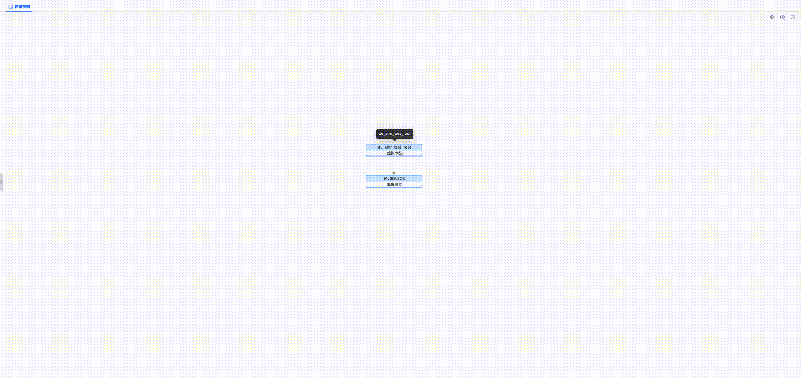
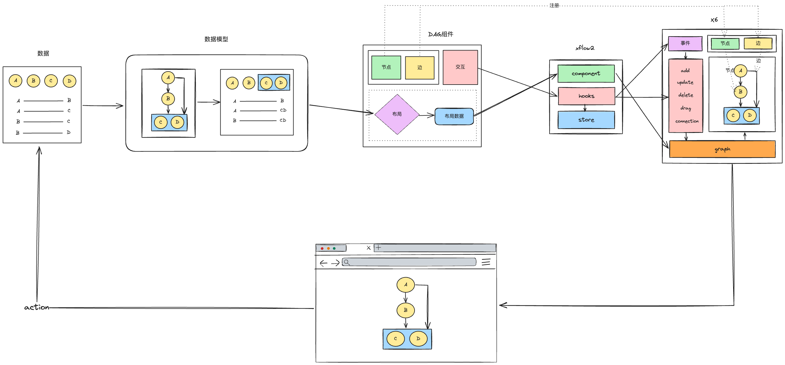
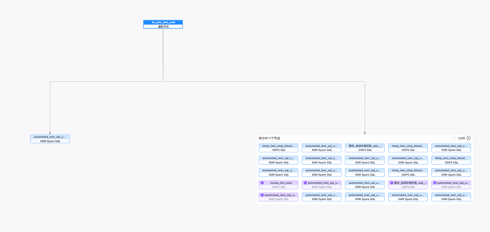
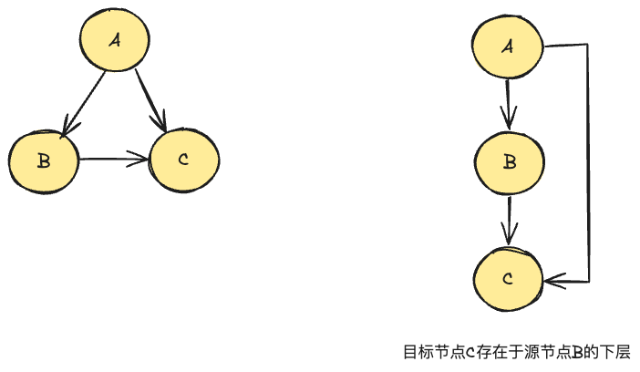
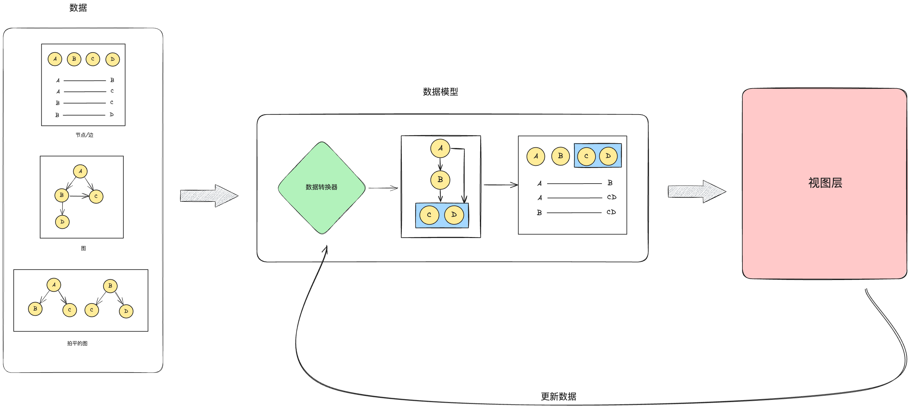
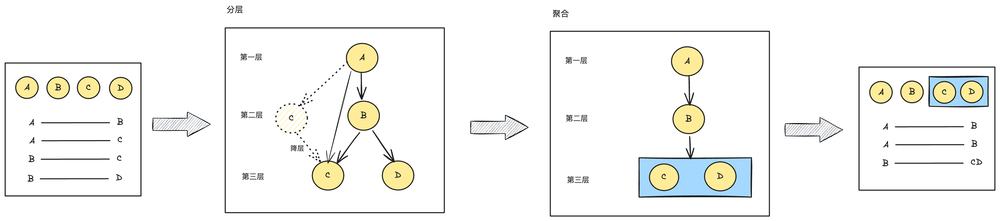
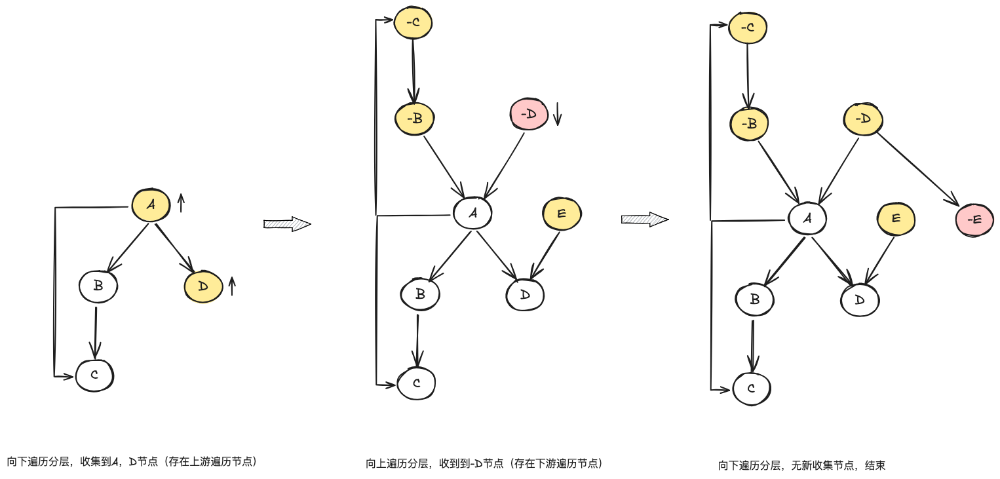
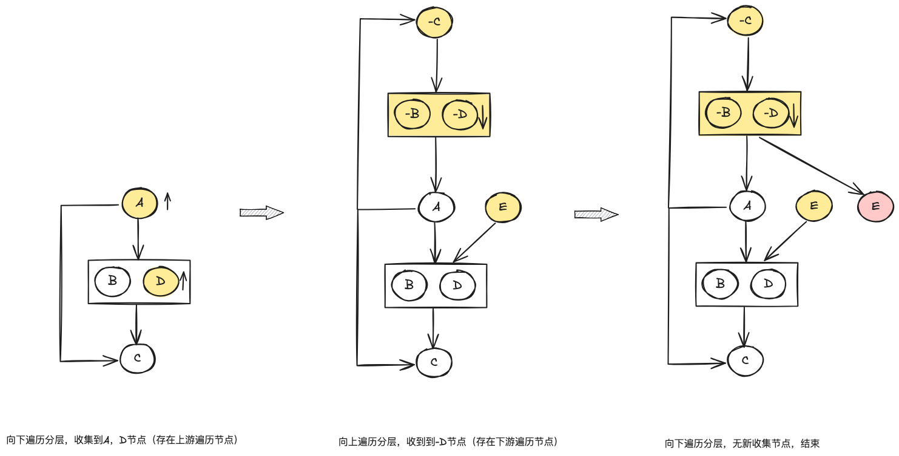

### DAG 图形解决方案

<!-- - DAG 图形解决方案是为了解决不同 DAG 图形渲染的统一方案，支持自定义节点，边，并实现节点自动聚合核心能力，满足大数据量节点（1w+）渲染，并支持动态扩展节点。 -->

DAG 图形解决方案是一种解决不同业务场景的 DAG 图形渲染和交互的方案。

- 定制化能力：通过注册不同的节点，边，图形布局实现定制化图形效果。
- 大数据能力：通过聚合节点，按需加载等方案解决大数据渲染压力，更好的用户体验，目前支持 1w+节点渲染。
- 交互编排能力：可视化拖拽交互编排的能力。



### 接入方式

```javascript
<GalaxyDag
  modelOptions={{
    nodes, // 节点
    edegs, // 边
    rootNode, //  根节点
    groupNumber: 10, // 节点需要聚合的数量
  }}
  nodes={{
    // 普通节点
    [NodeTypeEnum.Normal]: {
      shape: DAG_NODE, // 节点标识
      width: NODE_WIDTH, // 节点宽度
      height: NODE_HEIGHT, // 节点高度
      effect: ['data'], // 节点更新条件
      component: NormalNodeWrap, // 自定义普通节点组件
    },
    // 聚合节点
    [NodeTypeEnum.Group]: {
      shape: DAG_GROUP_NODE,
      width: GROUP_WIDTH,
      height: GROUP_HEIGHT,
      effect: ['data'],
      component: GroupNode, // 自定义聚合节点组件
    },
  }}
  dagModelRef={dagModelRef} // 数据模型实例
  dagGraphRef={dagGraphRef} // DAG图形实例
/>
```

### 架构设计



- 源数据：不同的源数据类型，可以是节点/边，图，拍平的图等等。
- 数据模型：统一的源数据处理，优化图的生成，图的动态更新
- DAG 组件：自定义节点/边，提供图形布局，工具栏，交互的能力。
- xflow2：连接 x6 的桥梁，提供易用的 hook。
- x6：底层渲染交互的引擎。

### 数据模型

数据模型是统一的处理不同数据源类型的模型，可生成节点自动聚合的图，并支持图动态更新的能力。

- 统一的数据源处理：抹平不同数据源的差异，将节点/边数据结构或图或拍平的图等转换为统一的可遍历的数据结构
- 图的生成：基于原始数据结构生成层级分明，节点可聚合的图。

  - 聚合节点：大数据节点聚合分页展示，保证完整的图可观看性，相同类型节点聚合分页展示。

    

  - 目标节点只存在于源节点的下层：保证图依赖关系清晰，层次分明

    

- 图的更新：提供在原图的基础上动态更新的能力。

  - 向上扩展
  - 向下扩展

数据模型的架构图，如下



对于 DAG 数据模型来说需要实现图的生成和更新。

图的生成和更新有不同的方法，每种方法擅长的场景不同，也都存在各自的优缺点，主要存在`增量解法`和`分层聚合解法` 两种方式，详情设计和对比请查看。

因为考虑到开发成本和系统的复杂度，实际也不会出现特别巨量的数据，所以目前采用`分层聚合解法` 实现数据模型的设计。

#### 分层聚合解法

##### 整体设计



1. 遍历源数据，建立节点之间的关系
2. 从中心节点向下层序遍历每个节点，确定每个节点的层级，目标节点是同层或上层节点会进行降层。遍历的过程中会收集未遍历的上游节点，然后向上层序遍历，节点分层，收集节点，递归遍历完所有的节点。
3. 向下层序遍历每个节点，如果节点的直接下游节点满足聚合节点数量对下游节点进行聚合，遍历的过程中会收集未遍历的上游节点，然后向上层序遍历，节点聚合，收集节点，递归遍历完所有的节点。
4. 从中心节点向下层序遍历生成节点/边，遍历的过程中会收集未遍历的上游节点，然后向上层序遍历，生成节点/边，收集节点，递归遍历完所有的节点。

##### 分层

分层时需要确定每个节点的层级，为了后续节点聚合。节点分层时从中心节点向下逐层对每个节点遍历进行分层。但是中心节点的下游节点，向上扩展出的节点不会遍历到，所以在遍历下游节点的时候需要收集需要扩展的上游节点，然后对收集的节点反方向向上遍历，遍历的时候又需要收集扩展的下游节点，依次递归遍历完所有的节点。



##### 聚合

聚合遍历方式和分层一致，聚合时目标节点的直接下游节点达到聚合数量需要聚合，聚合时

1. 生成新的聚合节点，原节点属于聚合节点子节点
2. 聚合节点代替原节点的建立上游节点和下游节点的关系


